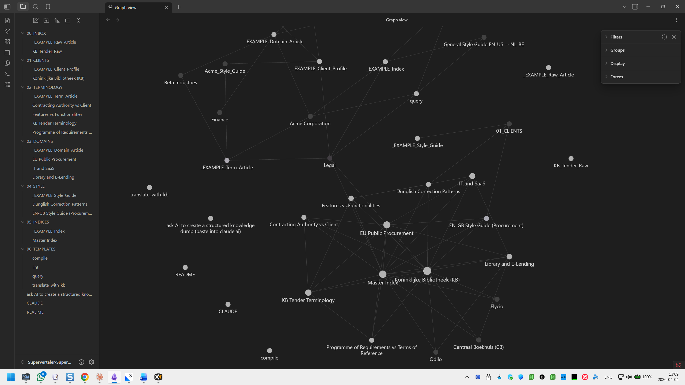

# Memory banks

A **memory bank** is a self-organising translation knowledge base that replaces traditional translation memories and term bases with a living, AI-maintained wiki. Instead of rigid fuzzy matching, a memory bank gives the AI full contextual understanding of your clients, terminology decisions, domain conventions, and style preferences.

Memory banks are the knowledge layer the Supervertaler Assistant consults before every translation, before every chat reply, and whenever you run Process Inbox, Distill, or Health Check.

<figure><figcaption><p>A memory bank knowledge graph showing interconnected clients, terminology, and domain knowledge</p></figcaption></figure>

## How it works

A memory bank is built on [Obsidian](https://obsidian.md/) and stores all knowledge as interlinked Markdown files – human-readable, portable, and future-proof.

The workflow has three phases:

### 1. Ingest

Drop raw material into the inbox: client briefs, style guides, glossaries, feedback notes, reference articles, or previous translations. Use [Quick Add](memory-banks/quick-add.md) to capture terms while translating, or [Distill](memory-banks/distill.md) to extract knowledge from TMX files, Word documents, PDFs, and termbases.

### 2. Process

The AI reads your raw material and writes structured knowledge base articles:

* **Client profiles** – language preferences, terminology decisions, style rules, project history
* **Terminology articles** – approved translations with rejected alternatives and the reasoning behind each choice
* **Domain knowledge** – conventions, common pitfalls, and reference material for specific fields (legal, medical, technical, marketing)
* **Style guides** – formatting rules, register, localisation conventions

Every article is interlinked with backlinks, so you can navigate from a client to their preferred terms to the domain those terms belong to.

### 3. Maintain

Your memory bank periodically scans itself for inconsistencies: conflicting terminology, broken links, stale content, missing cross-references. It heals itself – like a librarian who keeps the shelves organised.

## Why a memory bank?

| Traditional TM/TB                | Memory bank                                         |
| -------------------------------- | --------------------------------------------------- |
| Fuzzy matching on surface text   | Contextual understanding of _why_ terms were chosen |
| Static – requires manual updates | Self-healing – AI maintains and interlinks          |
| Opaque – hard to audit decisions | Every decision traceable to a readable `.md` file   |
| Locked to one tool               | Portable Markdown – works with any editor           |
| Segments in isolation            | Connected knowledge graph                           |

## Folder structure

Each memory bank organises its knowledge into six folders:

| Folder           | Contents                                                     |
| ---------------- | ------------------------------------------------------------ |
| `00_INBOX`       | Raw material – drop zone for unprocessed content             |
| `01_CLIENTS`     | Client profiles and preferences                              |
| `02_TERMINOLOGY` | Term articles with translations, alternatives, and reasoning |
| `03_DOMAINS`     | Domain-specific conventions and pitfalls                     |
| `04_STYLE`       | Style guides and formatting rules                            |
| `05_INDICES`     | Auto-generated indexes and maps of content                   |

## Multiple banks

You can keep several memory banks side by side – for example, one per major client, or one per domain – and switch between them from the Memory bank dropdown in the Supervertaler Assistant toolbar. The active bank is the one the AI consults until you pick another; switching is immediate, with no restart required.

All of your memory banks live under a single parent folder (the **memory banks folder**) which defaults to:

```
C:\Users\{you}\Supervertaler\memory-banks\
```

Each bank is a subfolder with the six-folder skeleton shown above:

```
memory-banks\
├── default\
│   ├── 00_INBOX\
│   ├── 01_CLIENTS\
│   └── …
├── acme-legal\
│   ├── 00_INBOX\
│   └── …
└── pharma\
    └── …
```

Create, rename, and delete banks from **Settings → Memory banks**. The dropdown in the toolbar lists every bank it finds under the memory banks folder.

## Getting started

A new install ships with one empty memory bank named `default` under the memory banks folder listed above.

1. Open the `default` folder as a vault in [Obsidian](https://obsidian.md/) – see [Obsidian Setup](memory-banks/obsidian-setup.md) for installation and configuration
2. Drop raw material (client briefs, glossaries, feedback) into `00_INBOX`
3. Click **[Process Inbox](memory-banks/process-inbox.md)** in the Supervertaler Assistant toolbar to organise your raw material into structured articles
4. Watch your knowledge graph grow as connections form between clients, terms, and domains

When you want a separate knowledge base for a different client or domain, open **Settings → Memory banks** and click **Create new bank**.

## Features

| Feature | Description |
|---------|-------------|
| **[Quick Add](memory-banks/quick-add.md)** | Capture terms and corrections while translating (Ctrl+Alt+M) |
| **[Process Inbox](memory-banks/process-inbox.md)** | Organise raw material into structured KB articles |
| **[Health Check](memory-banks/health-check.md)** | Scan and repair the knowledge base |
| **[Distill](memory-banks/distill.md)** | Extract knowledge from translation files (TMX, DOCX, PDF, termbases) |
| **[Active Prompt](memory-banks/active-prompt.md)** | Per-project prompt that Quick Add appends terminology to |
| **[AI Integration](memory-banks/ai-integration.md)** | How the memory bank enhances translations and chat |
| **[Obsidian Setup](memory-banks/obsidian-setup.md)** | Installing Obsidian and the Web Clipper |

## Learn more

The memory bank design is inspired by Andrej Karpathy's [LLM Knowledge Base](https://venturebeat.com/data/karpathy-shares-llm-knowledge-base-architecture-that-bypasses-rag-with-an) architecture. Templates for the six-folder skeleton are available on [GitHub](https://github.com/Supervertaler/Supervertaler-SuperMemory) (the repo still uses the project's original name).
