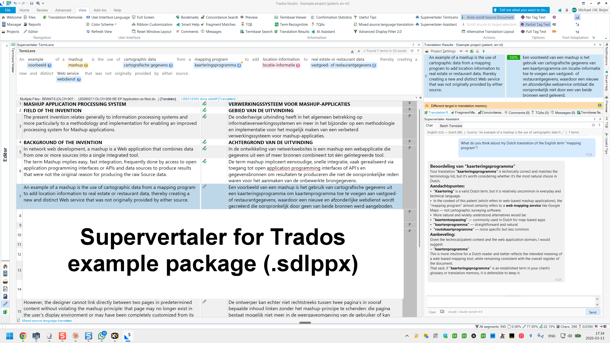

# Example Project

Supervertaler for Trados includes a downloadable example project so you can see the plugin in action without setting anything up yourself. The example is a Dutch-to-English patent translation that comes pre-loaded with terminology, a translation memory, and a Supervertaler termbase.

<figure><figcaption>
The example project open in Trados Studio with TermLens active.
</figcaption></figure>

## What's Included

The example package contains:

| File | Description |
|------|-------------|
| `Example project (patent, en-nl).sdlppx` | Trados Studio project package — open this in Trados |
| `supervertaler_example.db` | Supervertaler termbase with patent terminology (Dutch → English) |
| `Example project (patent, en-nl).svproj` | Supervertaler project file |
| `Example project (patent, en-nl)_backup.tmx` | Translation memory in TMX format |
| `US8312383.docx` | Source document (US patent) |
| `US8312383.pdf` | Original patent PDF for reference |

## How to Use It

### 1. Download

Download the example package zip from the [latest release on GitHub](https://github.com/Supervertaler/Supervertaler-for-Trados/releases).

Look for **`Supervertaler_for_Trados_-_example_package_(.sdlppx).zip`** in the release assets.

### 2. Extract

Extract the zip to a folder on your computer (e.g. `C:\Supervertaler Example`).

### 3. Open the Trados Package

Double-click the `.sdlppx` file or use **File → Open Package** in Trados Studio to import the project.

### 4. Configure the Termbase

1. Open the **Settings** dialog (gear icon in the TermLens panel header)
2. On the **TermLens** tab, click **+ Add** and browse to `supervertaler_example.db` in the folder where you extracted the zip
3. Click **OK**

### 5. Start Translating

Open a file in the Editor view. You should see:

- **TermLens chips** appearing above each segment with matched terminology
- **TM matches** in the Match Panel on the right
- Click any term chip (or press **Alt+1** through **Alt+9**) to insert the translation

### 6. Try the AI Features

If you have an API key configured (see [Getting Started](getting-started.md#3.-configure-ai-ai-settings-tab)):

- Press **Ctrl+Alt+A** to AI-translate the current segment
- Open the **Supervertaler Assistant** panel to ask questions about the current segment


The example project is a real patent document, so it's a good test of how TermLens handles technical terminology in context.


---

## See Also

- [Getting Started](getting-started.md)
- [TermLens](termlens.md)
- [Batch Translate](batch-translate.md)
