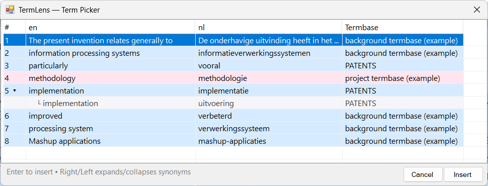

# Term Picker


You are viewing help for **Supervertaler for Trados** – the Trados Studio plugin. Looking for help with the standalone app? Visit [Supervertaler Workbench help](https://supervertaler.gitbook.io/help/workbench/).


The Term Picker is a compact overlay that shows all matched terms for the current segment in a sortable, keyboard-navigable list. It is useful when TermLens shows many matches and you want a quick overview without scrolling.

<figure><figcaption>
Term Picker dialogue with all matched terms for the current segment
</figcaption></figure>

### Opening the Term Picker

Press **Ctrl+Shift+P** to open the Term Picker. It appears as a floating window above the editor.


Looking for the memoQ-style Ctrl-tap behaviour? That now opens the [TermLens popup](termlens-popup.md) – a more compact in-context view of the same matches. The Term Picker dialogue described on this page is the list-based alternative for users who prefer a tabular UI.


### Colour-coded rows

Each row in the Term Picker is colour-coded by termbase type:

| Colour     | Meaning                             |
| ---------- | ----------------------------------- |
| **Pink**   | Project termbase term               |
| **Blue**   | Regular Supervertaler termbase term |
| **Yellow** | Non-translatable term               |
| **Green**  | MultiTerm termbase term (`.sdltb`)  |

This lets you instantly see where each term comes from and how it should be handled.

### Expandable synonyms

Terms with multiple translations display a right-arrow indicator (**▸**) next to the term. To expand and see all synonym sub-rows:

* Select the row and press the **Right arrow** key
* The sub-rows appear below the parent term, showing each available translation

Press **Left arrow** to collapse the synonyms again.

### Keyboard navigation

The Term Picker is designed for fast keyboard use:

| Key           | Action                                        |
| ------------- | --------------------------------------------- |
| **0-9**       | Type a number to jump directly to that term   |
| **Enter**     | Insert the selected term and close the picker |
| **Escape**    | Close the picker without inserting            |
| **Up / Down** | Navigate between terms (wraps around)         |
| **Right**     | Expand synonyms for the selected term         |
| **Left**      | Collapse synonyms                             |

Navigation wraps around: pressing **Down** on the last term jumps to the first, and **Up** on the first jumps to the last.

### Inserting a term

You can insert a term in two ways:

* **Click** any row to insert that term at the cursor position in the target field
* **Press Enter** on the selected row to insert and close

The selected translation is placed at the current cursor position in the target segment.


The Term Picker shows the same matches as TermLens, but in a flat list format that is easier to scan when there are many results.


***

### See Also

* [Adding & Editing Terms](adding-terms.md)
* [TermLens (Workbench)](https://supervertaler.gitbook.io/supervertaler/glossaries/termlens)
* [Termbase Management](../termbase-management.md)
