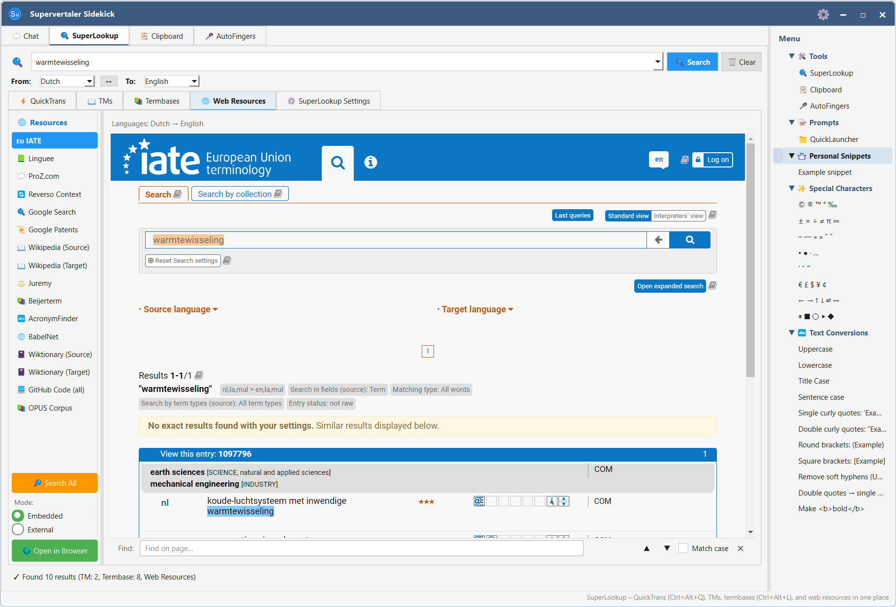

# Sidekick Overview

**Supervertaler Sidekick** is the floating side panel in Supervertaler Workbench. It stays visible while you translate, giving you quick access to four areas without switching away from your translation grid.

### Tabs

#### 🔍 SuperLookup

Simultaneous search across your Translation Memory, glossaries, machine translation engines, and web resources – all in one panel. When you select text in the editor and press **Ctrl+K**, Sidekick opens directly to SuperLookup with that text pre-filled as the search query.

→ [SuperLookup Overview](../superlookup/overview.md)

#### 💬 Chat

The AI assistant tab. Ask questions about terminology, get translation suggestions, or use Studio Tools to interact with your current project. Supports all major AI providers (OpenAI, Claude, Gemini, Ollama).

When **Supervertaler for Trados** is also running with the AI Assistant panel active, the Chat tab automatically picks up the active Trados project context — segment, TM matches, termbase hits, surrounding segments — so you can ask the floating chat questions about your real translation work without leaving Trados Studio.

→ [AI Translation Overview](../ai-translation/overview.md)\
→ [Trados-aware Chat](trados-aware-chat.md)

#### 📋 Clipboard

A persistent clipboard history that captures everything you copy — text snippets and images — from any application. Click any item to paste it into the active window. History survives restarts.

→ [Clipboard Manager](clipboard.md)

#### 🎤 AutoFingers

Voice commands and push-to-talk dictation. Create commands that press keyboard shortcuts, run scripts, or call Workbench functions — then speak them while working in Trados, memoQ, Word, or any other app.

→ [AutoFingers Voice Commands](autofingers.md)

***

### Opening Sidekick

| How                                | Shortcut       | Notes                                                                                                                       |
| ---------------------------------- | -------------- | --------------------------------------------------------------------------------------------------------------------------- |
| Open / hide Sidekick from anywhere | **Alt+K**      | Opens to whichever tab was last active, unless a default tab is set                                                         |
| Open SuperLookup from the editor   | **Ctrl+K**     | Opens Sidekick directly to the SuperLookup tab and runs a search on any selected text                                       |
| SuperLookup from any application   | **Ctrl+Alt+L** | System-wide shortcut – select text in any app, press the shortcut, and SuperLookup opens with that text as the search query |

Press **Esc** to hide Sidekick and return focus to whatever was active.

#### Setting a default tab

By default, **Alt+K** reopens Sidekick to whichever tab you last used. To always open to a specific tab, right-click that tab's title inside Sidekick and choose **Set as default tab**.

***

### Keyboard navigation inside Sidekick

| Key                               | Action                                                   |
| --------------------------------- | -------------------------------------------------------- |
| **Ctrl+Tab** / **Ctrl+Shift+Tab** | Cycle through the four tabs                              |
| **Tab**                           | Move focus from the active tab into the right-pane Menu  |
| **Left**                          | Return focus from the Menu to the last active tab widget |
| **Esc**                           | Hide Sidekick entirely                                   |

***

### Receiving QuickLauncher prompts from Trados

When **Supervertaler for Trados** is also running, Sidekick can be the destination for Ctrl+Q QuickLauncher prompts triggered inside Trados Studio. The user picks a prompt in Trados, the expanded prompt is sent to Sidekick over a localhost bridge, Sidekick pops to the front, maximises to the screen it's on, switches to the Chat tab, and the response renders there instead of in the in-Trados Assistant.

This is opt-in on the Trados side – a dropdown in Trados → **Settings → AI Settings → "QuickLauncher prompts go to:"** picks between the in-Trados Assistant (default) and Workbench Sidekick. Sidekick is always ready to receive; nothing in Workbench needs to be configured.

If Workbench isn't running when Trados tries to send a prompt, Trados silently falls back to its own Assistant – the prompt is never lost.

→ [Sidekick Bridge (Trados help)](https://supervertaler.gitbook.io/help/trados/ai-assistant/sidekick-bridge) – wire format and troubleshooting

***

### Related pages

* [SuperLookup Overview](../superlookup/overview.md)
* [AutoFingers Voice Commands](autofingers.md)
* [Clipboard Manager](clipboard.md)
* [Keyboard Shortcuts](../settings/shortcuts.md)
